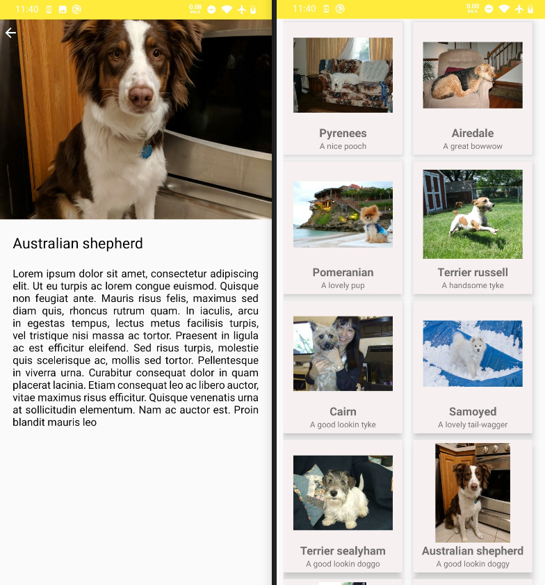
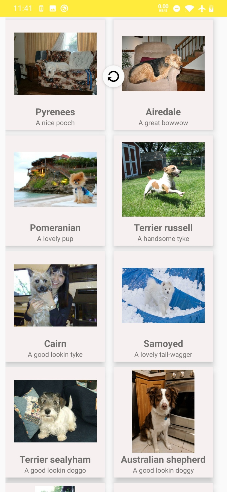

<!-- ABOUT APP -->
## About The Project

A simple Android application which shows photos of dogs and allows to see each photo in a detail view. 

Basic features are:
- Get a list of dog photos from the JSON API (https://dog.ceo/api/breeds/image/random/50)
- Show a gallery view of all dog photos
- Show a detail view for a single dog photo

  

 <h3 align="center">Doggo App</h3>

  
  
Additional feature: 
- Swipe down to referesh on gallery view to get new dog photos

  
 

## Improvements

Some of the ways the application could be improved:
- Use clean architecture (MVVM)
- Implement pagination
- Optimize User-Interface to better fit all screen sizes

<b>Note:</b> The application was tested on an emulator running API level 26 and on a physical device running API level 28 (therefore certain functions might not work as intended on older versions of Android)

Since the JSON API only provides links to dog photos, name of the dog breed is taken from the link of the photo, see [DogsActivity.kt](/app/src/main/java/com/vasilije/doggo/ui/DogsActivity.kt) file!
